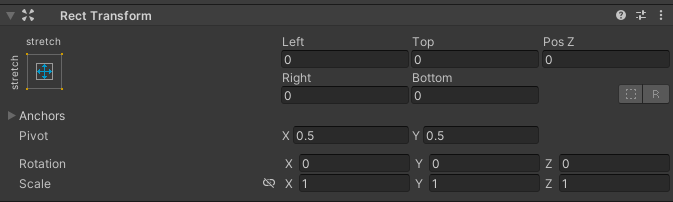
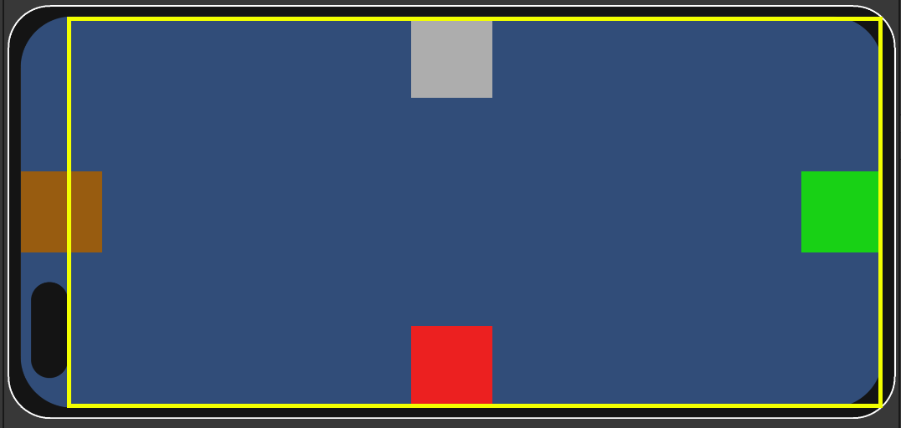
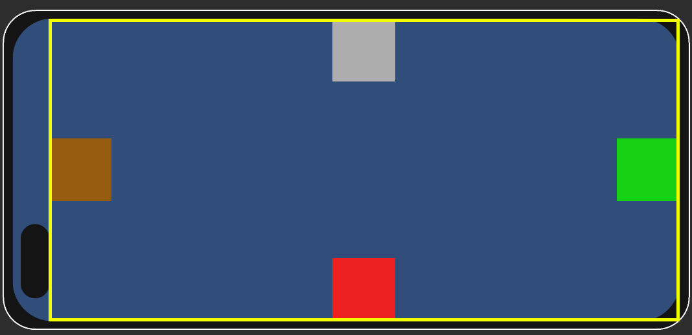

# Safe Area Controller

## Install via UPM (using Git URL)
````
https://github.com/Qofi26/unity.safe-area.git?path=/SafeAreaProject/Assets/SafeArea#v/0.1.0
````

## Basic Usage

Add `SafeAreaController` to your RectTransform object with stretch settings



### Before


### After

